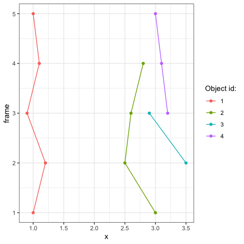
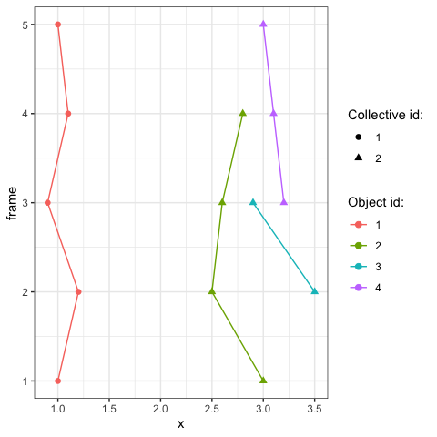

<!-- README.md is generated from README.Rmd. Please edit that file -->

```{r, include = FALSE}
knitr::opts_chunk$set(
  collapse = TRUE,
  comment = "#>",
  fig.path = "man/figures/README-",
  out.width = "100%"
)
```

# ARCOS

<!-- badges: start -->
<!-- badges: end -->

ARCOS stands for **A**utomated **R**ecognition of **Co**llective **S**ignalling. 

The goal of ARCOS is to identify and track spatially clustered objects in time series data in 1-, 2-, and 3D geometries. The algorithm tackles the problem of identification of protein activation in 2- and 3D cell cultures that occur collectively in neighbouring cells over time. Despite its focus on cell signalling, the algorithm can be also applied to other spatially correlated phenomena that occur over time.

Collective waves of protein activation have been recently identified in various biological systems. They have been demonstrated to play an important role in the maintenance of epithelial homeostasis ([Gagliardi et al., 2020](https://doi.org/10.1101/2020.06.11.145573), [Takeuchi et al., 2020](https://doi.org/10.1016/j.cub.2019.11.089), [Aikin et al., 2020](https://doi.org/10.7554/eLife.60541)), in the acinar morphogenesis ([Ender et al., 2020](https://doi.org/10.1101/2020.11.20.387167)), osteoblast regeneration ([De Simone et al., 2021](https://doi.org/10.1038/s41586-020-03085-8)), and in the coordination of collective cell migration ([Aoki et al., 2017](https://doi.org/10.1016/j.devcel.2017.10.016), [Hino et al., 2020](https://doi.org/10.1016/j.devcel.2020.05.011)).


Key features of the *aggregative tracking* algorithm implemented in the `ARCOS::trackCollEvents` function:

- data for tracking should be organised in the long format where each row is object's location and time,
- the function accepts objects in a long-format `data.table`,
- the `data.table` [package](https://cran.r-project.org/web/packages/data.table/) is used as the main data structure throughout the ARCOS package,
- the `dbscan` [package](https://cran.r-project.org/web/packages/dbscan/) is used for the spatial clustering.


## Installation

You can install the released version of ARCOS from [CRAN](https://CRAN.R-project.org) with:

``` r
install.packages("ARCOS")
```

And the development version from [GitHub](https://github.com/) with:

``` r
# install.packages("devtools")
devtools::install_github("dmattek/ARCOS")
```
## Example

In this example 4 distinct objects are moving in 1 dimension over 5 time points. We aim to identify clusters of objects moving close to each other.

### Time sequence

The minimal data in the long format consists of 3 columns:

- `frame` with the frame number that corresponds to the time point,
- `objid` with the unique identifier of every object,
- `x` with the position of the object.


``` r
library(ARCOS)
library(data.table)

dtIn = data.table(frame = c(1, 1, 2, 2, 2, 3, 3, 3, 3, 4, 4, 4, 5, 5),
                  objid = c(1, 2, 1, 2, 3, 1, 2, 3, 4, 1, 2, 4, 1, 4),
                  x = c(1, 3, 1.2, 2.5, 3.5, 0.9, 2.6, 2.9, 3.2, 1.1, 2.8, 3.1, 1, 3))
```

```
> head(dtIn, 3)
    frame objid   x
 1:     1     1 1.0
 2:     1     2 3.0
 3:     2     1 1.2
```

Each object has a distinct identifier represented by a different colour in the plot:



### Detection and tracking

In this step 3 objects on the right are grouped into a single collective event that spans 5 frames. A single object on the left forms a trivial single-object event. 

The most important parameter of the `trackCollEvents` function is the search radius `inEps`, which sets the distance for:

- the `dbscan` spatial clustering in a single time frame,
- possible objects that can be part of collective events identified in previous frame(s).

The minimum size of the spatial cluster is set using the `inMinPts` parameter, which is also passed to `dbscan`. The parameter `inNprev` determines the number of previous frames that are searched for collective events in order to match them to objects in the current frame.

The parameter `inCols` contains a list with column names of the input data (`frame`, `id`, `x`, `y`, `z`) and the name of the column with identifiers of collective events in the output (`collid`). The `trackCollEvents` function works in 1-, 2-, or 3D, therefore the names of respective position columns x/y/z need to be supplied depending on the geometry.

``` r
dtColl = trackCollEvents(dtIn,
                         inEps = 0.6,
                         inMinPts = 1L,
                         inNprev = 1L,
                         inCols = list(frame = "frame",
                                       x = "x",
                                       id = "objid",
                                       collid = "collid"),
                         inDeb = F)
```

The output contains 3 columns with the frame number, object identifier, and the calculated identifier of the collective event:

``` r
> head(dtColl, 3)
   frame objid collid
1:     1     1      1
2:     1     2      2
3:     2     1      1
```

### Visualisation

In order to visualise collective events we merge the table computed by the `trackCollEvents` function with the original table by the frame number (column `time`) and the object identifier (column `objid`):


``` r
dtIn = merge(dtIn, 
             dtColl, 
             by = c("frame", "objid"))
```

``` r
> head(dtIn, 3)
   frame objid   x collid
1:     1     1 1.0      1
2:     1     2 3.0      2
3:     2     1 1.2      1
```

Each trace is assigned an identifier of the collective event, which is represented by the shape of the point in the plot:



