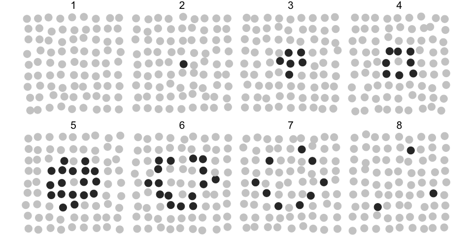
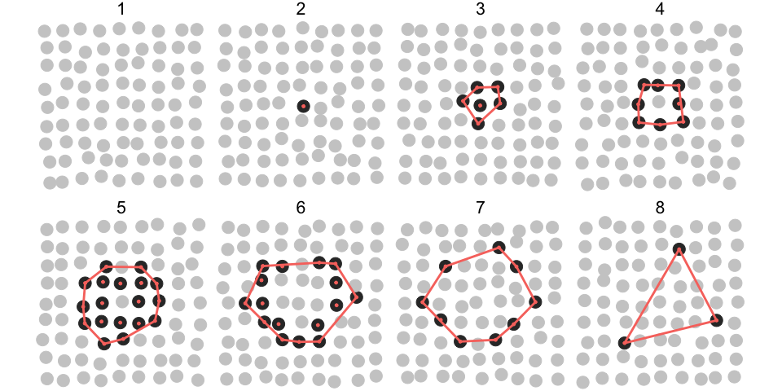
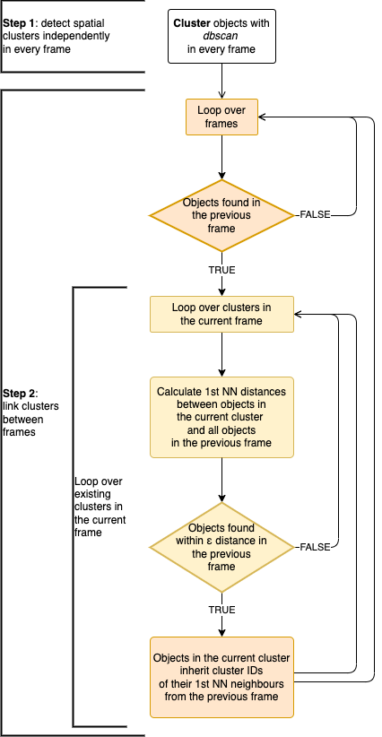

<!-- README.md is generated from README.Rmd. Please edit that file -->

# ARCOS

<!-- badges: start -->
<!-- badges: end -->

**A**utomated **R**ecognition of **Co**llective **S**ignalling (ARCOS)
is an [R](https://www.r-project.org) package to identify space-time
correlations in biological data. The associated publication in the
Journal of Cell Biology is available
[here](https://doi.org/10.1083/jcb.202207048).

The software identifies and visualises collective protein activation in
2- and 3D cell cultures over time. Such collective phenomena have been
recently identified in various biological systems. They have been
demonstrated to play an important role in the: (1) maintenance of the
epithelial homeostasis ([Gagliardi et al.,
2020](https://doi.org/10.1016/j.devcel.2021.05.007), [Takeuchi et al.,
2020](https://doi.org/10.1016/j.cub.2019.11.089), [Aikin et al.,
2020](https://doi.org/10.7554/eLife.60541)), (2) acinar morphogenesis
([Ender et al., 2020](https://doi.org/10.1101/2020.11.20.387167)), (3)
osteoblast regeneration ([De Simone et al.,
2021](https://doi.org/10.1038/s41586-020-03085-8)), and (4) coordination
of collective cell migration ([Aoki et al.,
2017](https://doi.org/10.1016/j.devcel.2017.10.016), [Hino et al.,
2020](https://doi.org/10.1016/j.devcel.2020.05.011)).


Despite its focus on cell signalling, the framework can be also applied
to other spatially correlated phenomena that occur over time in an
arbitrary spatial dimension.

## Implementations

This repository covers the R implementation. For other implementations
check:

- [arcos4py](https://github.com/bgraedel/arcos4py), a Python
  implementation written by Benjamin Grädel.
- [arcos-gui](https://github.com/bgraedel/arcos-gui), a plugin with GUI
  for [napari](https://napari.org) image viewer; written by Benjamin
  Grädel. See a YouTube
  [demo](https://www.youtube.com/watch?v=hG_z_BFcAiQ).

Please visit the main ARCOS project page for general documentation and
installation instructions [gitbook](https://arcos.gitbook.io/home/).

<figure>

<figcaption aria-hidden="true">arcos-gui plugin for napari image
viewer</figcaption>
</figure>

## Cite

If you are using ARCOS in your research please cite the relevant paper:

    @article{gagliardi2023,
        author = {Gagliardi, Paolo Armando and Gr\"adel, Benjamin and Jacques, Marc-Antoine and Hinderling, Lucien and Ender, Pascal and Cohen, Andrew R. and Kastberger, Gerald and Pertz, Olivier and Dobrzy\'nski, Maciej},
        title = "{Automatic detection of spatio-temporal signaling patterns in cell collectives}",
        journal = {Journal of Cell Biology},
        volume = {222},
        number = {10},
        pages = {e202207048},
        year = {2023},
        month = {07},
        issn = {0021-9525},
        doi = {10.1083/jcb.202207048}
    }

## Installation

You can install the development version from
[GitHub](https://github.com/dmattek/ARCOS) with:

``` r
# install.packages("devtools")
devtools::install_github("dmattek/ARCOS")
```

## Data format

The minimal input comprises time series arranged in [long
format](https://en.wikipedia.org/wiki/Wide_and_narrow_data#Narrow),
where each row defines object’s location and time.

ARCOS defines an `arcosTS` object that extends the `data.table`
[class](https://cran.r-project.org/web/packages/data.table/). In
practice, additional attributes are added to the existing `data.table`
object to define column names relevant for the analysis.

## Example

The following synthetic dataset contains 81 objects (e.g., biological
cells) spaced on a 2D 9x9 lattice with a spacing of 1x1 length units.
Each object has an ID (column `id`) and can assume values 0 and 1
(column `m`), which correspond to an *inactive* and *active* state. The
evolution of active states takes place over 8 consecutive time points
(column `t`). Each object wiggles slightly around its position.

``` r
library(ARCOS)
#> The legacy packages maptools, rgdal, and rgeos, underpinning the sp package,
#> which was just loaded, will retire in October 2023.
#> Please refer to R-spatial evolution reports for details, especially
#> https://r-spatial.org/r/2023/05/15/evolution4.html.
#> It may be desirable to make the sf package available;
#> package maintainers should consider adding sf to Suggests:.
#> The sp package is now running under evolution status 2
#>      (status 2 uses the sf package in place of rgdal)
library(ggplot2)

# Generate a synthetic dataset with a single event evolving over 8 frames
dts = ARCOS::genSynthSingle2D(inSeed = 7)
```

|   t |      x |        y |   m |  id |
|----:|-------:|---------:|----:|----:|
|   1 | 0.2287 | -0.15890 |   0 |   1 |
|   1 | 0.8803 | -0.11770 |   0 |   2 |
|   1 | 1.9310 |  0.07860 |   0 |   3 |
|   1 | 2.9590 |  0.18980 |   0 |   4 |
|   1 | 3.9030 | -0.04138 |   0 |   5 |
|   1 | 4.9050 |  0.06777 |   0 |   6 |

In the plot below, grey circles correspond to inactive and black to
active states of objects and their collective activation (*wave*)
develops over 8 time points.



The following R code will identify the collective event and store the
result in a `dcoll` variable. We are interested in a collective event
comprised of *active* objects, hence we select rows with `m > 0`. The
parameter `eps` sets the threshold radius for the spatial clustering
(`dbscan` algorithm). Here, we set `eps = 2`, which is enough to find
all the nearest active objects in the cluster, given the 1x1 horizontal
and vertical spacing of objects in the lattice.

``` r
# Track collective events
dcoll = ARCOS::trackColl(dts[m > 0], 
                         eps = 2.)
```

|   t |  id | collid.frame | collid |     x |     y |   m |
|----:|----:|-------------:|-------:|------:|------:|----:|
|   2 |  41 |            1 |      1 | 4.157 | 3.915 |   1 |
|   3 |  32 |            2 |      1 | 3.890 | 2.989 |   1 |
|   3 |  40 |            2 |      1 | 3.086 | 4.194 |   1 |
|   3 |  41 |            2 |      1 | 3.998 | 3.955 |   1 |
|   3 |  42 |            2 |      1 | 5.060 | 4.063 |   1 |
|   3 |  50 |            2 |      1 | 3.838 | 4.911 |   1 |

The `dcoll` table contains the results of spatio-temporal clustering.
Column `collid` stores a unique identifier of the collective event. The
`collid.frame` column stores an identifier of collective event that is
unique only within a frame.

For better visualisation, we add convex hulls around collective events
using the `chull` function from the `grDevices` package.

``` r
# Create convex hulls around collective events for visualisation
dcollch = dcoll[,
                .SD[grDevices::chull(x, y)],
                by = .(t,
                       collid)]
```

In the following plot, objects that participate in the collective event
are indicated by red dots. The red polygon indicates a convex hull.



### Save frames

The code below saves individual time frames as `png` files in the
`frames` folder located in the current working directory.

``` r
ARCOS::savePlotColl2D(dts, dcoll, 
                      outdir = "./frames",
                      xlim = c(-.5,9),
                      ylim = c(-.5,9),
                      plotwh = c(4,3),
                      imtype = "png")
```

Individual files can be later combined into a movie using software such
as [ffmpeg](http://ffmpeg.org).

For example, if you have `ffmpeg` installed on your system, create an
`mp4` movie at 2 frames/second and a 520x420 pixel resolution by typing
the following line in the command line:

``` bash
ffmpeg -framerate 2 -i "frames/F%04d.png" -vcodec libx264 -s 560x420 -pix_fmt yuv420p frames-all.mp4
```

### Visualise interactively

Interactive visualisation with an accompanying shiny app located in
`inst/shiny-examples/collVisApp`.

``` r
library(shiny)
library(plotly)
library(RColorBrewer)

ARCOS::runCollVis(dts, dcoll)
```

## The algorithm

<figure>

<figcaption aria-hidden="true">arcos-gui plugin for napari image
viewer</figcaption>
</figure>
