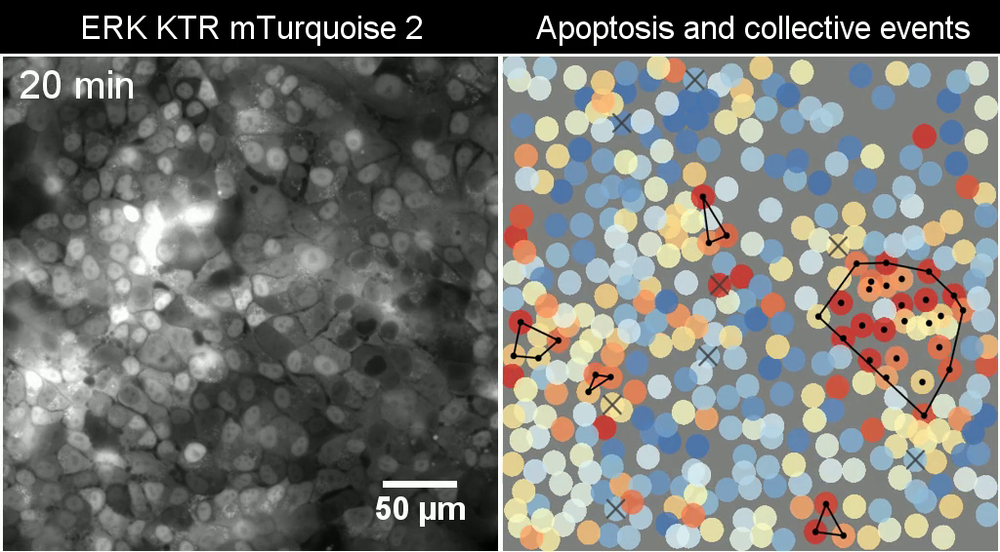

  
```{r, include = FALSE}
knitr::opts_chunk$set(
collapse = TRUE,
comment = "#>"
)
```

```{r setup, warning=FALSE}
library(ARCOS)
library(ggplot2)
library(ggnewscale)
```


# Intro

ARCOS stands for **A**utomated **R**ecognition of **Co**llective **S**ignalling. The package implements an algorithm for identification and tracking of spatially clustered objects in time series data. It works with 1-, 2-, and 3D geometries. 

The algorithm identifies collective protein activation in 2- and 3D cell cultures over time. Such collective waves of protein activation have been recently identified in various biological systems. They have been demonstrated to play an important role in the maintenance of epithelial homeostasis ([Gagliardi et al., 2020](https://doi.org/10.1016/j.devcel.2021.05.007), [Takeuchi et al., 2020](https://doi.org/10.1016/j.cub.2019.11.089), [Aikin et al., 2020](https://doi.org/10.7554/eLife.60541)), in the acinar morphogenesis ([Ender et al., 2020](https://doi.org/10.1101/2020.11.20.387167)), osteoblast regeneration ([De Simone et al., 2021](https://doi.org/10.1038/s41586-020-03085-8)), and in the coordination of collective cell migration ([Aoki et al., 2017](https://doi.org/10.1016/j.devcel.2017.10.016), [Hino et al., 2020](https://doi.org/10.1016/j.devcel.2020.05.011)).

Despite the focus on cell signalling, the algorithm can be also applied to other spatially correlated phenomena that occur over time.



## Data format

ARCOS defines an `arcosTS` object that extends the `data.table` [class](https://cran.r-project.org/web/packages/data.table/). In practice, the `arcosTS` function adds additional attributes that prescribe column names relevant for the analysis to the existing `data.table` object.

Time series should be arranged in **long format**, where each row is object's location, time, and optionally the measurement value.

## The algorithm

General flow of the *aggregative tracking* algorithm implemented in the `ARCOS::trackColl` function:

1. In the first frame, every available object becomes a *seed* of a collective event.
3. The `dbscan` algorithm aims to cluster all objects in the current frame. Objects within a *threshold distance* are clustered into collective events with a minimum *threshold size*.
4. Move to the next frame and match objects to collective events identified in previous frames. To match objects between frames, calculate the Cartesian product of two long-format tables. One holds all current objects, the other holds all objects from collective events in the previous frame(s). 
5. All unmatched objects in the current frame form *seeds* of new collective events.

The `RANN::nn2` [function](https://www.rdocumentation.org/packages/RANN/versions/2.6.1/topics/nn2) is used to calculate nearest neighbour distances. The `dbscan::dbscan` [function](https://www.rdocumentation.org/packages/dbscan/versions/1.1-6/topics/dbscan) is used for spatial clustering.

## Functions

**Main functions**:

- `arcosTS` creates an arcosTS object from time series data in long format stored in a `data.table`. Assigns relevant column names and data parameters.
- `trackColl` identifies and tracks collective events.

**Visualisation functions**:

- `plotTracks` plots a random selection of tracks in 1 or 2D.
- `runCollVis` visualises collective events in an interactive shiny app.

**Post-processing**:

- `calcStatsColl` calculates basic statistics of collective events such as duration aand size. 
- `selColl` selects collective events based on their duration and size.

**Export functions**:

- `export2napari` exports data in a format suitable for [napari](https://napari.org) image viewer.
- `savePlotColl2D` saves individual frames as images.

**Measurement-related**:

- `interpolMeas` interpolates missing data in time series.
- `histMeas` plots a histogram of the measurement.
- `clipMeas` clips the measurement to a prescribed range or quantiles.
- `binMeas` de-trends, normalises and binarises the measurement in time series.
- `plotBinMeas` plots the result of de-trending and binarisation.
- `histTrackLen` plots a histogram of track lengths.
- `selTrackLen` selects tracks from time series data based on their length.

**Utility functions**:

- `is.arcosTS` checks whether an object is an arcosTS object.
- `keepSignifDig` trims numeric columns to a prescribed number of significant digits.
- `genSynth2D` generate synthetic data in 2D.
- `loadDataFromFile` loads time series data from a file and returns an arcosTS object.
- `loadDataFromImages` loads time series data from images and returns an arcosTS object.

# Main application

The following synthetic dataset contains 81 objects spaced on a 2D 9x9 lattice. Each object has an ID (columns `id`) and can assume two values 0 and 1 (column `m`), which corresponds to an inactive and active state. The evolution of active states takes place over 8 consecutive frames (column `t`).

```{r}
dts = ARCOS::genSynth2D(inSeed = 7)

knitr::kable(head(ARCOS::keepSignifDig(dts, 4)))
```

In the plot below, grey circles correspond to inactive and black to active states of objects. The collective activation (*wave*) develops over 8 time points.

```{r, fig.height=5, fig.width=10}
p1 = ggplot(dts,
            aes(x = x,
                y = y)) +
  geom_point(aes(color = as.factor(m)), size = 5) +
  scale_color_manual(values = c("grey80",
                                "grey20")) +
  facet_wrap(~ t, ncol = 4) +
  coord_fixed(ratio=1) +
  theme_void() +
  theme(text = element_text(size = 20),
        legend.position = "none")

p1
```

The following snippet will identify the collective event and will store the result in `dcoll`. We are interested in a collective event comprised of *active* object, hence we select rows with `m>0`.

```{r}
# Track collective events
dcoll = ARCOS::trackColl(dts[m>0], 
                         eps = 2.)

knitr::kable(head(ARCOS::keepSignifDig(dcoll, 4)))
```

The `dcoll` table contains the results of spatio-temporal clustering. Column `collid` stores a unique identifier of collective event. The `collid.frame` column stores an identifier of collective event that is unique only within a frame.

For visualisation, we can add convex hulls around collective events.

```{r}
# Create convex hulls around collective events fro visualisation
dcollch = dcoll[,
                .SD[grDevices::chull(x, y)],
                by = .(t,
                       collid)]
```

In the following plot, objects that participate in a collective event are indicated by red dots. The red polygon indicates a convex hull.

```{r, fig.height=5, fig.width=10}
p2 = ggplot(dts,
            aes(x = x,
                y = y)) +
  geom_point(aes(color = as.factor(m)), size = 5) +
  scale_color_manual(values = c("grey80",
                                "grey20")) +
  ggnewscale::new_scale_color() +
  geom_point(data = dcoll,
             aes(color = as.factor(collid)), size = 1) +
  geom_polygon(data = dcollch,
               aes(color = as.factor(collid)),
               fill = NA, 
               size = 1) +
  facet_wrap(~ t, ncol = 4) +
  coord_fixed(ratio=1) +
  theme_void() +
  theme(text = element_text(size = 20),
        legend.position = "none")

p2
```

## Save frames

The snippet below will save individual time frames as `png` files in the `frames` folder located in the current working directory.

```{r, eval=F}
ARCOS::savePlotColl2D(dts, dcoll, 
                      outdir = "./frames",
                      xlim = c(-.5,9),
                      ylim = c(-.5,9),
                      plotwh = c(4,3),
                      imtype = "png")
```

Individual files can be later combined into a movie using software such as [ffmpeg](http://ffmpeg.org). 

For example, if you have `ffmpeg` installed on your system, create an `mp4` movie at 2 frames/second and a 520 by 420 px resolution by typing the following line in the command line:

```{bash, eval = F}
ffmpeg -framerate 2 -i "frames/F%04d.png" -vcodec libx264 -s 560x420 -pix_fmt yuv420p frames-all.mp4
```


## Visualise interactively

Interactive visualisation with an accompanying shiny app located in `inst/shiny-examples/collVisApp`.

```{r, eval=F}
library(shiny)
library(plotly)
library(RColorBrewer)

ARCOS::runCollVis(dts, dcoll)
```
