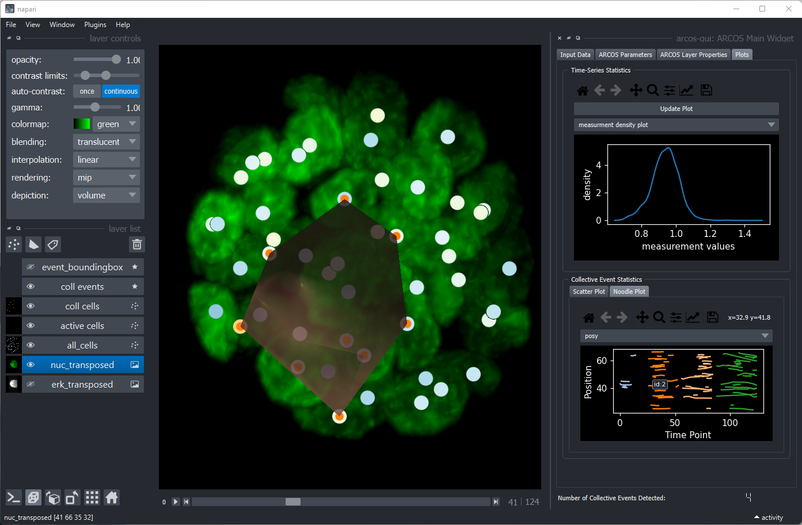
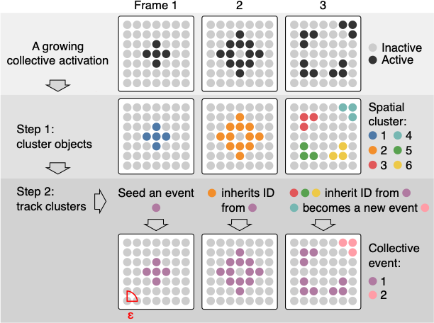
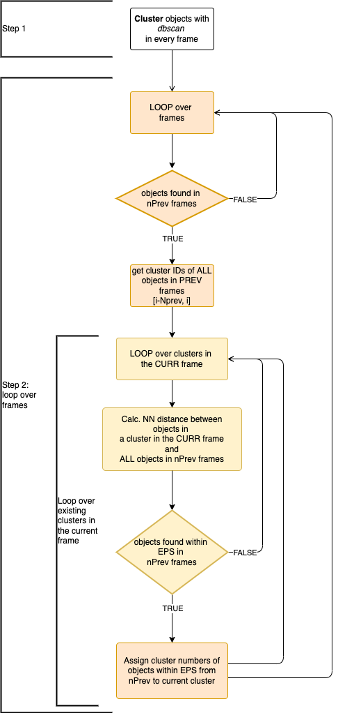

```{r, include = FALSE}
knitr::opts_chunk$set(
  collapse = TRUE,
  comment = "#>"
)
```

```{r setup, warning=FALSE}
library(data.table)
library(ARCOS)
library(ggplot2)
library(ggnewscale)
```


# Intro

**A**utomated **R**ecognition of **Co**llective **S**ignalling (ARCOS) is an [R](https://www.r-project.org) package to identify collective spatial events in time series data. The associated publication is available on [bioRxiv](https://www.biorxiv.org/content/10.1101/2022.07.12.499734v1).

The software identifies and visualises collective protein activation in 2- and 3D cell cultures over time. Such collective waves have been recently identified in various biological systems. They have been demonstrated to play an important role in the maintenance of epithelial homeostasis ([Gagliardi et al., 2020](https://doi.org/10.1016/j.devcel.2021.05.007), [Takeuchi et al., 2020](https://doi.org/10.1016/j.cub.2019.11.089), [Aikin et al., 2020](https://doi.org/10.7554/eLife.60541)), in the acinar morphogenesis ([Ender et al., 2020](https://doi.org/10.1101/2020.11.20.387167)), osteoblast regeneration ([De Simone et al., 2021](https://doi.org/10.1038/s41586-020-03085-8)), and in the coordination of collective cell migration ([Aoki et al., 2017](https://doi.org/10.1016/j.devcel.2017.10.016), [Hino et al., 2020](https://doi.org/10.1016/j.devcel.2020.05.011)).


Despite its focus on cell signalling, the framework can be also applied to other spatially correlated phenomena that occur over time in an arbitrary spatial dimension.

## Implementations

This repository covers the R implementation. For other implementations check:

- [arcos4py](https://github.com/bgraedel/arcos4py), a Python implementation written by Benjamin Grädel.
- [arcos-gui](https://github.com/bgraedel/arcos-gui), a plugin with GUI for [napari](https://napari.org) image viewer; written by Benjamin Grädel. See a YouTube [demo](https://www.youtube.com/watch?v=hG_z_BFcAiQ).

Documentation for the entire ARCOS project can be found on [gitbook](https://arcos.gitbook.io/home/).




## Installation

You can install the development version from [GitHub](https://github.com/dmattek/ARCOS) with:

``` r
# install.packages("devtools")
devtools::install_github("dmattek/ARCOS")
```

## The algorithm

The algorithm implemented in the `ARCOS::trackColl` function consists of two steps:

1. In every frame, objects are clustered with the [dbscan](https://en.wikipedia.org/wiki/DBSCAN) algorithm.
2. Clusters are linked between the frames if objects that comprise the cluster are within a threshold distance.

The `RANN::nn2` [function](https://www.rdocumentation.org/packages/RANN/versions/2.6.1/topics/nn2) is used to calculate nearest neighbour distances. The `dbscan::dbscan` [function](https://www.rdocumentation.org/packages/dbscan/versions/1.1-6/topics/dbscan) is used for spatial clustering.



The flowchart of the algorithm: 



## Functions

**Main functions**:

- `arcosTS` creates an arcosTS object from time series data in long format stored in a `data.table`. Assigns relevant column names and data parameters.
- `trackColl` identifies and tracks collective events.

**Visualisation functions**:

- `plotTracks` plots a random selection of tracks in 1 or 2D.
- `plotNoodle2D` creates a noodle/spaghetti plot; a single position coordinate is plotted over time for objects during their participation in collective events.
- `runCollVis` visualises collective events in an interactive shiny app.

**Post-processing**:

- `calcNNdists` calculates nearest neighbour distances between objects to give an idea about the search radius for spatial clustering.
- `calcStatsColl` calculates basic statistics of collective events such as duration and size. 
- `selColl` selects collective events based on their duration and size.

**Export functions**:

- `export2napari` exports data as several files that can be imported as layers into [napari](https://napari.org) image viewer.
- `savePlotColl2D` saves individual frames as images.

**Measurement pre-processing**:

- `interpolMeas` interpolates missing data in time series.
- `histMeas` plots a histogram of the measurement.
- `clipMeas` clips the measurement to a prescribed range or quantiles.
- `binMeas` de-trends, normalises and binarises the measurement in time series.
- `plotBinMeas` plots sample time series and visualises measurement de-trending/rescaling/binarisation.
- `histTrackLen` plots a histogram of track lengths.
- `selTrackLen` selects tracks from time series data based on their length.

**Utility functions**:

- `is.arcosTS` checks whether an object is an arcosTS object.
- `keepSignifDig` trims numeric columns to a prescribed number of significant digits.
- `genSynth2D` generate synthetic data in 2D with a single collective event over 8 frames.
- `genRandSynth2D` generate a random sequence of synthetic collective events in 2D.
- `loadDataFromFile` loads time series data from a file and returns an arcosTS object.
- `loadDataFromImages` loads time series data from images and returns an arcosTS object.


# 1D example

Here, 4 distinct objects are moving in 1 dimension over 5 time points. We aim to identify clusters of objects moving close to each other.

## Time sequence

The minimal data in [long format](https://en.wikipedia.org/wiki/Wide_and_narrow_data#Narrow) consists of 3 columns:

- `frame` with the frame number that corresponds to the time point,
- `objid` with the unique identifier of every object,
- `x` with the position of the object.


```{r echo = T, results="asis"}
dts1 = data.table(frame = c(1, 1, 2, 2, 2, 3, 3, 3, 3, 4, 4, 4, 5, 5),
                  objid = c(1, 2, 1, 2, 3, 1, 2, 3, 4, 1, 2, 4, 1, 4),
                  x = c(1, 3, 1.2, 2.5, 3.5, 0.9, 2.6, 2.9, 3.2, 1.1, 2.8, 3.1, 1, 3))

knitr::kable(dts1)
```

Initiate an `arcosTS` object. Specify the names of frame, object id, and positions columns. The function simply adds attributes to the existing data.table object.

```{r, echo = T}
ARCOS::arcosTS(dt = dts1, 
               colFrame = "frame", 
               colIDobj = "objid", 
               colPos = "x")
```

Plot the time series. Each object has a distinct identifier represented by a different colour in the plot:

```{r, echo = T, fig.width=5, fig.height=4, caption="Visualisation of object traces over time"}
ARCOS::plotTracks(dts1)
```

## Detection and tracking

In this step 3 objects at the top are grouped into a single collective event that spans 5 frames. A single object at the bottom forms a single-object event. 

The most important parameter of the `trackColl` function is the search radius `eps`, which sets the distance for:

- the `dbscan` spatial clustering in a single time frame,
- linking clusters between frames; clusters in consecutive frames are linked, if objects comprising them are within the threshold radius.

The minimum size of the spatial cluster is set using the `minClSz` parameter, which is also passed to `dbscan`. The parameter `nPrev` determines the number of previous frames that are searched for collective events in order to link them to the current frame.

```{r, echo = T}
dcoll1 = ARCOS::trackColl(dts1)
```

The output contains 3 columns with the frame number, object identifier, and the calculated identifier of the collective event:

```{r echo=F, results="asis"}
knitr::kable(dcoll1)
```

## Visualisation

Each trace is assigned an identifier of the collective event, which is represented by the shape of the point in the plot:

```{r, echo = F, fig.width=5, fig.height=4, caption="Visualisation of collective events over time"}
ARCOS::plotTracks(dcoll1)
```

The algorithm with the default search radius `eps=1.0` has identified two collective events. One is an event with only a single object, the latter is an event that consists of 1 to 3 objects at different points in time.


# 2D example

The following synthetic dataset contains 81 objects (e.g., biological cells) spaced on a 2D 9x9 lattice with a spacing of 1x1 length units. Each object has an ID (column `id`) and can assume values 0 and 1 (column `m`), which correspond to an *inactive* and *active* state. The evolution of active states takes place over 8 consecutive time points (column `t`). Each object wiggles slightly around its position. 

```{r}
# Generate a synthetic dataset with a single event evolving over 8 frames
dts2 = ARCOS::genSynth2D(inSeed = 7)

knitr::kable(head(dts2), digits = 2)
```

In the plot below, grey circles correspond to inactive and black to active states of cells and their collective activation (*wave*) develops over 8 time points.

```{r, fig.height=5, fig.width=10}
p1 = ggplot(dts2,
            aes(x = x,
                y = y)) +
  geom_point(aes(color = as.factor(m)), size = 5) +
  scale_color_manual(values = c("grey80",
                                "grey20")) +
  facet_wrap(~ t, ncol = 4) +
  coord_fixed(ratio=1) +
  theme_void() +
  theme(text = element_text(size = 20),
        legend.position = "none")

p1
```

## Identify collective events

The following R code will identify the collective event and store the result in a `dcoll` variable. We are interested in a collective event comprised of *active* objects, hence we select rows with `m > 0`. The parameter `eps` sets the threshold radius for the spatial clustering (`dbscan` algorithm). Here, we set `eps = 2`, which is enough to find all the nearest active objects in the cluster, given the 1x1 horizontal and vertical spacing of objects in the lattice.

```{r}
# Track collective events
dcoll2 = ARCOS::trackColl(dts2[m > 0], 
                          eps = 2.)

knitr::kable(head(dcoll2), digits = 2)
```

The `dcoll` table contains the results of spatio-temporal clustering. Column `collid` stores a unique identifier of collective event. The `collid.frame` column stores an identifier of collective event that is unique only within a frame.

## Visualise events

For better visualisation, we add convex hulls around collective events using the `chull` function from the `grDevices` package.

```{r}
# Create convex hulls around collective events fro visualisation
dcollch2 = dcoll2[,
                  .SD[grDevices::chull(x, y)],
                  by = .(t,
                         collid)]
```

In the following plot, objects that participate in collective events are indicated by red dots. The red polygon indicates a convex hull.

```{r, fig.height=5, fig.width=10}
p2 = ggplot(dts2,
            aes(x = x,
                y = y)) +
  geom_point(aes(color = as.factor(m)), size = 5) +
  scale_color_manual(values = c("grey80",
                                "grey20")) +
  ggnewscale::new_scale_color() +
  geom_point(data = dcoll2,
             aes(color = as.factor(collid)), size = 1) +
  geom_polygon(data = dcollch2,
               aes(color = as.factor(collid)),
               fill = NA, 
               size = 1) +
  facet_wrap(~ t, ncol = 4) +
  coord_fixed(ratio=1) +
  theme_void() +
  theme(text = element_text(size = 20),
        legend.position = "none")

p2
```

## Spaghetti/noodle plot

Spaghetti/noodle plot is another useful visualisation of collective events. A single position of cell tracks is plotted over time, however cells tracks are plotted only when objects/cells participate in the collective event.

```{r, fig.width=6, fig.height=3}
ARCOS::plotNoodle2D(dcoll2, style = 'both') +
  xlab("Time [frames]") +
  ylab("Position X [au]") +
  theme_minimal() +
  theme(legend.position = "none")
```

## Extract measurements

### Growth over time

```{r, fig.width=5, fig.height=3}
dcoll2growth = calcGrowthColl(dcoll2)

ggplot(dcoll2growth,
       aes(x = tevent,
           y = diam)) +
  geom_line() +
  geom_point() +
  xlab("Time of the event [frames]") +
  ylab("Diameter [au]") +
  theme_bw()
```
### Size & duration

Extract duration (`totDur`), total number of unique objects involved in the event (`totSz`), the smallest and largest number of objects in the event (`minSz` & `maxSz`).

```{r results='asis'}
knitr::kable(calcStatsColl(dcoll2))
```


## Save frames

The code below saves individual time frames with the field of view as `png` files in the `frames` folder located in the current working directory.

```{r, eval=F}
ARCOS::savePlotColl2D(dts2, dcoll2, 
                      outdir = "./frames",
                      xlim = c(-.5,9),
                      ylim = c(-.5,9),
                      plotwh = c(4,3),
                      imtype = "png")
```

Individual files can be later combined into a movie using software such as [ffmpeg](http://ffmpeg.org). 

For example, if you have `ffmpeg` installed on your system, create an `mp4` movie at 2 frames/second and a 520x420 pixel resolution by typing the following line in the command line:

```{bash, eval = F}
ffmpeg -framerate 2 -i "frames/F%04d.png" -vcodec libx264 -s 560x420 -pix_fmt yuv420p frames-all.mp4
```


## Visualise interactively

Interactive visualisation with an accompanying shiny app located in `inst/shiny-examples/collVisApp`.

```{r, eval=F}
library(shiny)
library(plotly)
library(RColorBrewer)

ARCOS::runCollVis(dts2, dcoll2)
```
