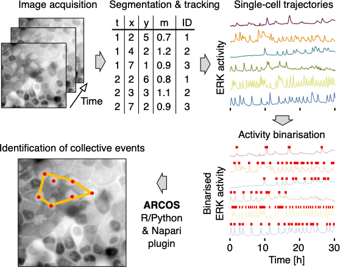

```{r, include = FALSE}
knitr::opts_chunk$set(
  collapse = TRUE,
  comment = "#>"
)
```

```{r setup, warning=FALSE}
library(data.table)
library(ARCOS)
library(ggplot2)
library(ggthemes)
library(ggnewscale)
```


# Intro

Using ARCOS to detect collective activation events in biological systems requires identification of *active* objects, i.e., objects that will be passed to the clustering algorithm. In practice the single-cell activity obtained from image segmentation needs to be thresholded and binarised. ARCOS offers several approaches to perform such approaches that will be covered below. 

 

# Load time-series data

Time-series data obtained, for example, from image segmentation should be in [long format](https://en.wikipedia.org/wiki/Wide_and_narrow_data#Narrow). Here we use a sample dataset of single-cell ERK activity from MCF10A WT epithelial cells. See the associated publication on [bioRxiv](https://www.biorxiv.org/content/10.1101/2022.07.12.499734v1) for more details about biological problems that can be analysed with ARCOS.

```{r loadData, echo = T}
# define column names
lCols = list()
lCols$frame = 'frame'
lCols$trackid = 'trackid'
lCols$posx = 'x'
lCols$posy = 'y'
lCols$meas = 'meas'

# Load from file
dts = fread(system.file('testdata/sampleTS.csv.gz',
                        package = 'ARCOS'))

# create an ARCOS ts object
ARCOS::arcosTS(dts, 
               colPos = c(lCols$posx, lCols$posy), 
               colMeas = lCols$meas,
               colFrame = lCols$frame, 
               colIDobj = lCols$trackid)

knitr::kable(head(dts, 4), digits = 2)
```


# Measurement interpolation

The measurement may contain missing values or NAs, which can be interpolated using the `ARCOS::interpolMeas` function.

```{r interpolMeas, echo = T}
# interpolate
dts = ARCOS::interpolMeas(dts)
```

# Measurement distribution

Point outliers in the measurement can be clipped using the `ARCOS::clipMeas` function.

```{r histMeas, echo = T}
ARCOS::histMeas(dts, 
                clip = c(0.001, 0.999),
                quant = TRUE) + 
  ggthemes::theme_clean()
```

```{r clipMeas, echo = T, eval=FALSE}
ARCOS::clipMeas(dts, 
                clip = c(0.001, 0.999),
                quant = TRUE)
```


# Track lengths

De-trending is based on a running median, therefore, it requires time series that are approximately at least 4 times longer than the length of the de-trending median filter. 

```{r plotTrackLen1, echo = T}
ARCOS::histTrackLen(dts, binwidth = 10) 
```

Length of time series in frames. Frames acquired every 1 minute.

```{r trimTracks, results='asis'}
dts = ARCOS::selTrackLen(dts, lenmin = 660)

knitr::kable(
  dts[, 
      .N, 
      by = trackid])
```

# Identify activity

Regions of measurement activity identified with several methods available in the `ARCOS::binMeas` function.

## runmed

This approach uses a short-term smoothing filter to remove noise from time series and a long-term filter to remove trends.

1. Short-term smoothing to filter noise (median filter with $k = 5$ frames).
2. Long-term smoothing to de-trend (median filter with $k = 201$ frames).
3. Rescale if the difference between min and max is greater than $peakThr = 0.05$.
4. Binarise the final signal with $binThr = 0.1$.


```{r idActiveRunmed1, echo = T}
# binarise the measurement
ARCOS::binMeas(dts,
               biasMet = "runmed", 
               smoothK = 5L,
               biasK = 501L,
               peakThr = 0.05,
               binThr = 0.1)
```


The `ARCOS::binMeas` function adds `meas.resc` and `meas.bin` columns to the original dataset. Below is a plot of the original time series compared to de-trended/rescaled and binarised output. The `meas.bin` column should be used to filter the rows such that only *active* cells are used to detect collective events, i.e., `ARCOS::trackColl(dts[meas.bin > 0])`.

```{r, echo=TRUE}
knitr::kable(head(dts), digits = 2)
```


```{r plotActiveRunmed1, echo = T, fig.width=7, fig.height=5}
p1 = ARCOS::plotBinMeas(dts, 
                        ntraj = 0L, 
                        xfac = 1 / 60.,
                        plotResc = TRUE,
                        inSeed = 3L) +
  geom_hline(yintercept = 0.1, 
             color = "#F28E2B", 
             linetype = "dashed") +
  ggthemes::theme_few() +
  xlab("Time [h]") +
  ylab("C/N ERK-KTR")

p1
```

## lm

In this approach, a fit to a linear function is used to de-trend the time series.

1. Short-term smoothing to filter noise (median filter with $k = 5$).
2. De-trend by fitting a 5th order polynomial (median filter with $polyDeg = 5$).
3. Rescale if the difference between min and max is greater than $peakThr = 0.2$.
4. Binarise the final signal with $binThr = 0.2$.

```{r idActiveLM2, echo = T, fig.width=7, fig.height=5}
# binarise the measurement
ARCOS::binMeas(dts,
               biasMet = "lm", 
               smoothK = 5L,
               peakThr = 0.05,
               polyDeg = 5L,
               binThr = 0.2)

ARCOS::plotBinMeas(dts, 
                   ntraj = 0L, 
                   xfac = 1 / 60.,
                   plotResc = TRUE,
                   inSeed = 3L) +
  geom_hline(yintercept = 0.2, 
             color = "#F28E2B", 
             linetype = "dashed") +
  ggthemes::theme_few() +
  xlab("Time [h]") +
  ylab("C/(C+N) ERK-KTR")
```

## none

In this approach a fixed threshold is applied to rescaled time series.

1. Rescale all time series between global min and max.
2. Short-term smoothing to filter noise (median filter with $k = 5$).
4. Binarise the final signal with $binThr = 0.3$.

```{r idActiveNone2, echo = T, fig.width=7, fig.height=5}
# binarise the measurement
ARCOS::binMeas(dts,
               biasMet = "none", 
               smoothK = 5L,
               binThr = 0.3)

ARCOS::plotBinMeas(dts, 
                   ntraj = 0L, 
                   xfac = 1 / 60.,
                   plotResc = TRUE,
                   inSeed = 3L) +
  geom_hline(yintercept = 0.3, 
             color = "#F28E2B", 
             linetype = "dashed") +
  ggthemes::theme_few() +
  xlab("Time [h]") +
  ylab("C/(C+N) ERK-KTR")
```
