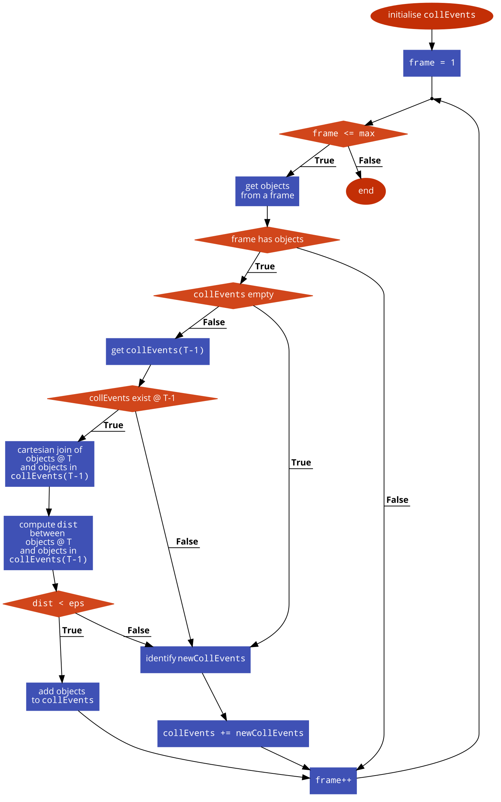

```{r, include = FALSE}
knitr::opts_chunk$set(
  collapse = TRUE,
  comment = "#>"
)
```

```{r setup}
library(ARCOS)
library(data.table)
library(reshape2)
library(ggplot2)
library(ggthemes)
library(OpenImageR)
library(testthat)
```


# Intro

Key features of the algorithm:

1. The algorithm analyses frames sequentially.
2. At the initial step, every *active* object becomes a collective event.
3. If objects are within a threshold distance, object are clustered together by `dbscan` into collective events with a minimum threshold size.
4. Matching of objects in subsequent frame to collective events identified in previous frames relies on calculating a cartesian product of two data tables. One holds all current objects, the other holds all objects that belong to collective events in previous frame(s). This will create a table with every current object having a column with all objects that belong to collective event(s) in previous frame(s).
5. Unmatched objects form new collective events as in step 3.

Algorithm flow prepared with [code2flow](https://app.code2flow.com/nboDrmgQxXvp). The code for the flowchart is [here](code2flow/code2flow_R9K3s8.md).

{width=500px}

# Detection from images

We start with detecting and tracking a concentrically growing cluster directly from a sequence of 12 binary PNG images. Original images have a 1024-by-1024 pixel resolution. For convenience, images are downsampled to 64x64 pixels. Each pixel in the downsampled image can be treated as a separate object, to which we assign an `objID` number. The `objID` identifier is the same for objects with the same X/Y position in subsequent frames.

```{r,echo=F}
# Prepare a string vector with image files to load
vFiles = list.files(path = file.path(system.file("concentricGrowth", package="ARCOS"), "png"), 
                    pattern = "*.png", 
                    full.names = T)

# Load images; store data in a long format in a data.table.
lIn = lapply(seq_along(vFiles), function (ii) {
  # Image file name
  locFin = vFiles[ii]
  
  # Read a PNG image
  locMbin = OpenImageR::readImage(locFin)
  
  # For convenience, downsample an image from 1024x1024 to 64x64 pixels.
  locMdown = OpenImageR::down_sample_image(locMbin, 
                                           factor = 16.0, 
                                           gaussian_blur = F)
  
  # Binarise the data to {0,1}; downsampling may introduce floats
  locM = locMdown > 0.5
  
  # Convert to long format
  locDT = as.data.table(reshape2::melt(locM, 
                                       value.name = "m"))
  setnames(locDT, 
           c("Var1", "Var2"), 
           c("y", "x"))
  
  # Add "time" and "cellID" columns
  locDT[,
        `:=`(m = as.numeric(m),
             objID = .I,
             time = ii)]
})

dtIn = rbindlist(lIn)
rm(vFiles, lIn)
```


The final long-format input data with active/inactive objects. Columns:

- `x` and `y` correspond to X/Y coordinates of an object,
- `m` contains the binarised measurement $\{0,1\}$ that corresponds to inactive/active objects, respectively. For the identification of collective events we will use only *active* objects, i.e. $m > 0$,
- `objID` holds an object identifier, which should be *at least* unique within a single frame,
- `time` indicates the frame number.

```{r echo=F, results="asis"}
knitr::kable(head(dtIn))
```

The time sequence with a growing concentric circle. Each frame (time point) consists of a matrix of 64x64 objects, where each object can have a value of the measurement of 0 (inactive) or 1 (active). In this example objects **do not** change their positions or identities across frames. In more general examples discussed further, both positions and object identifiers may change between frames.

```{r,echo=F, fig.width=6, fig.height = 5}
ggplot(dtIn,
       aes(x = x,
           y = y)) +
  geom_raster(aes(fill = as.factor(m))) +
  ggthemes::scale_fill_tableau(name = "Meas",
                               palette = "Classic Gray 5") +
  facet_wrap(~ time, ncol = 4) +
  coord_fixed(ratio=1) +
  scale_y_continuous(trans = "reverse") +
  xlab("x") +
  ylab("y") +
  theme_bw()
```

We use the `ARCOS::trackCollEvents` function to identify collective events in frames and to link them between frames into objects. Since we aim to identify the collective activation, we only pass a subset of data with *active* objects, i.e. `dtIn[m > 0]`.

```{r, echo = T}
allCl = ARCOS::trackCollEvents(inDT = dtIn[m > 0], 
                inEps = 4, 
                inMinPts = 1L, 
                inNprev = 1L, 
                inCols = list(frame = "time",
                              x = "x",
                              y = "y",
                              z = NULL,
                              id = "objID",
                              collid = "collID"),
                DEB = F)
```

The result from tracking of collective events is a long-format `data.table` with columns:

- `time` with the frame number,
- `objID` with an identifier of an object involved in a collective event,
- `collID` with an identifier of a collective event that is unique across the entire frame sequence.

```{r echo=F, results="asis"}
knitr::kable(head(allCl))
```

In order to visualise the collective events we merge the table computed by the `trackCollEvents` function with the original table by the frame number (column `time`) and the object identifier (column `objID`):

```{r echo = T}
dtRes = merge(dtIn,
              allCl,
              by = c("time", "objID"))
```


Here, we display frames with collective events. The algorithm identified a single event in 10 subsequent frames:

```{r, echo = F, fig.width=6, fig.height = 5}
ggplot(dtRes,
       aes(x = x,
           y = y)) +
  geom_raster(aes(fill = as.factor(collID))) +
  ggthemes::scale_fill_tableau(name = "ID collective\nevent",
                               palette = "Tableau 10") +
  facet_wrap(~ time) +
  scale_x_continuous(limits = c(min(dtIn$x), max(dtIn$x))) +
  scale_y_reverse(limits = c(max(dtIn$y), min(dtIn$y))) +
  coord_fixed(ratio=1) +
  xlab("x") +
  ylab("y") +
  theme_bw()
```

The comparison of the result against the ground truth:

```{r, echo = F, results="asis", eval = T}
resTest = testthat::test_that("dmd exp05", {
  locDTtrueRes = fread(file = file.path(system.file("concentricGrowth", package="ARCOS"), "exp05_out.csv"))
  expect_equal(allCl, locDTtrueRes)
})

if (resTest)
  cat("Test against the true result passed.") else 
    cat("Test against the true result did not pass!")
```
